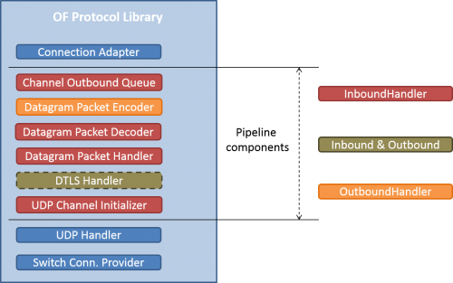
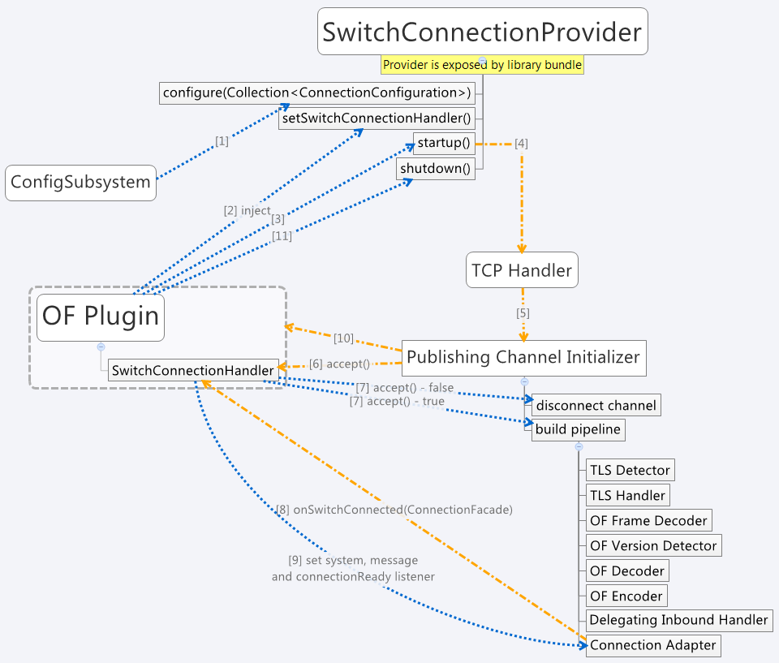
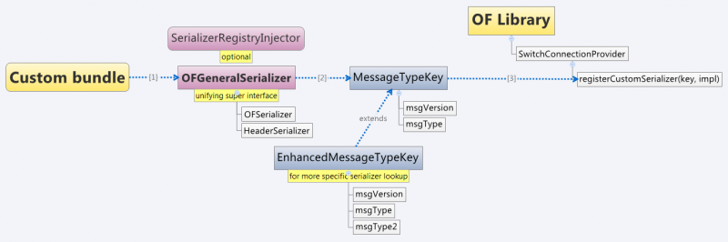

.. _openflow-protocol-library-dev-guide:

OpenFlow Protocol Library Developer Guide
=========================================

Introduction
------------

OpenFlow Protocol Library is component in OpenDaylight, that mediates
communication between OpenDaylight controller and hardware devices
supporting OpenFlow protocol. Primary goal is to provide user (or upper
layers of OpenDaylight) communication channel, that can be used for
managing network hardware devices.

Features Overview
-----------------

There are three features inside openflowjava:

-  **odl-openflowjava-protocol** provides all openflowjava bundles, that
   are needed for communication with openflow devices. It ensures
   message translation and handles network connections. It also provides
   openflow protocol specific model.

-  **odl-openflowjava-all** currently contains only
   odl-openflowjava-protocol feature.

-  **odl-openflowjava-stats** provides mechanism for message counting
   and reporting. Can be used for performance analysis.

odl-openflowjava-protocol Architecture
--------------------------------------

Basic bundles contained in this feature are openflow-protocol-api,
openflow-protocol-impl, openflow-protocol-spi and util.

-  **openflow-protocol-api** - contains openflow model, constants and
   keys used for (de)serializer registration.

-  **openflow-protocol-impl** - contains message factories, that
   translate binary messages into DataObjects and vice versa. Bundle
   also contains network connection handlers - servers, netty pipeline
   handlers, …

-  **openflow-protocol-spi** - entry point for openflowjava
   configuration, startup and close. Basically starts implementation.

-  **util** - utility classes for binary-Java conversions and to ease
   experimenter key creation

odl-openflowjava-stats Feature
------------------------------

Runs over odl-openflowjava-protocol. It counts various message types /
events and reports counts in specified time periods. Statistics
collection can be configured in
openflowjava-config/src/main/resources/45-openflowjava-stats.xml

Key APIs and Interfaces
-----------------------

Basic API / SPI classes are ConnectionAdapter (Rpc/notifications) and
SwitchConnectionProcider (configure, start, shutdown)

Installation
------------

Pull the code and import project into your IDE.

::

    git clone ssh://<username>@git.opendaylight.org:29418/openflowjava.git

Configuration
-------------

Current implementation allows to configure:

-  listening port (mandatory)

-  transfer protocol (mandatory)

-  switch idle timeout (mandatory)

-  TLS configuration (optional)

-  thread count (optional)

You can find exemplary Openflow Protocol Library instance configuration
below:

::

    <data xmlns="urn:ietf:params:xml:ns:netconf:base:1.0">
      <modules xmlns="urn:opendaylight:params:xml:ns:yang:controller:config">
        <!-- default OF-switch-connection-provider (port 6633) -->
        <module>
          <type xmlns:prefix="urn:opendaylight:params:xml:ns:yang:openflow:switch:connection:provider:impl">prefix:openflow-switch-connection-provider-impl</type>
          <name>openflow-switch-connection-provider-default-impl</name>
          <port>6633</port>
    <!--  Possible transport-protocol options: TCP, TLS, UDP -->
          <transport-protocol>TCP</transport-protocol>
          <switch-idle-timeout>15000</switch-idle-timeout>
    <!--       Exemplary TLS configuration:
                - uncomment the <tls> tag
                - copy exemplary-switch-privkey.pem, exemplary-switch-cert.pem and exemplary-cacert.pem
                  files into your virtual machine
                - set VM encryption options to use copied keys
                - start communication
               Please visit OpenflowPlugin or Openflow Protocol Library#Documentation wiki pages
               for detailed information regarding TLS -->
    <!--       <tls>
                 <keystore>/exemplary-ctlKeystore</keystore>
                 <keystore-type>JKS</keystore-type>
                 <keystore-path-type>CLASSPATH</keystore-path-type>
                 <keystore-password>opendaylight</keystore-password>
                 <truststore>/exemplary-ctlTrustStore</truststore>
                 <truststore-type>JKS</truststore-type>
                 <truststore-path-type>CLASSPATH</truststore-path-type>
                 <truststore-password>opendaylight</truststore-password>
                 <certificate-password>opendaylight</certificate-password>
               </tls> -->
    <!--       Exemplary thread model configuration. Uncomment <threads> tag below to adjust default thread model -->
    <!--       <threads>
                 <boss-threads>2</boss-threads>
                 <worker-threads>8</worker-threads>
               </threads> -->
        </module>

::

        <!-- default OF-switch-connection-provider (port 6653) -->
        <module>
          <type xmlns:prefix="urn:opendaylight:params:xml:ns:yang:openflow:switch:connection:provider:impl">prefix:openflow-switch-connection-provider-impl</type>
          <name>openflow-switch-connection-provider-legacy-impl</name>
          <port>6653</port>
    <!--  Possible transport-protocol options: TCP, TLS, UDP -->
          <transport-protocol>TCP</transport-protocol>
          <switch-idle-timeout>15000</switch-idle-timeout>
    <!--       Exemplary TLS configuration:
                - uncomment the <tls> tag
                - copy exemplary-switch-privkey.pem, exemplary-switch-cert.pem and exemplary-cacert.pem
                  files into your virtual machine
                - set VM encryption options to use copied keys
                - start communication
               Please visit OpenflowPlugin or Openflow Protocol Library#Documentation wiki pages
               for detailed information regarding TLS -->
    <!--       <tls>
                 <keystore>/exemplary-ctlKeystore</keystore>
                 <keystore-type>JKS</keystore-type>
                 <keystore-path-type>CLASSPATH</keystore-path-type>
                 <keystore-password>opendaylight</keystore-password>
                 <truststore>/exemplary-ctlTrustStore</truststore>
                 <truststore-type>JKS</truststore-type>
                 <truststore-path-type>CLASSPATH</truststore-path-type>
                 <truststore-password>opendaylight</truststore-password>
                 <certificate-password>opendaylight</certificate-password>
               </tls> -->
    <!--       Exemplary thread model configuration. Uncomment <threads> tag below to adjust default thread model -->
    <!--       <threads>
                 <boss-threads>2</boss-threads>
                 <worker-threads>8</worker-threads>
               </threads> -->
        </module>

::

        <module>
          <type xmlns:prefix="urn:opendaylight:params:xml:ns:yang:openflow:common:config:impl">prefix:openflow-provider-impl</type>
          <name>openflow-provider-impl</name>
          <openflow-switch-connection-provider>
            <type xmlns:ofSwitch="urn:opendaylight:params:xml:ns:yang:openflow:switch:connection:provider">ofSwitch:openflow-switch-connection-provider</type>
            <name>openflow-switch-connection-provider-default</name>
          </openflow-switch-connection-provider>
          <openflow-switch-connection-provider>
            <type xmlns:ofSwitch="urn:opendaylight:params:xml:ns:yang:openflow:switch:connection:provider">ofSwitch:openflow-switch-connection-provider</type>
            <name>openflow-switch-connection-provider-legacy</name>
          </openflow-switch-connection-provider>
          <binding-aware-broker>
            <type xmlns:binding="urn:opendaylight:params:xml:ns:yang:controller:md:sal:binding">binding:binding-broker-osgi-registry</type>
            <name>binding-osgi-broker</name>
          </binding-aware-broker>
        </module>
      </modules>

Possible transport-protocol options:

-  TCP

-  TLS

-  UDP

Switch-idle timeout specifies time needed to detect idle state of
switch. When no message is received from switch within this time, upper
layers are notified on switch idleness. To be able to use this exemplary
TLS configuration:

-  uncomment the ``<tls>`` tag

-  copy *exemplary-switch-privkey.pem*, *exemplary-switch-cert.pem* and
   *exemplary-cacert.pem* files into your virtual machine

-  set VM encryption options to use copied keys (please visit TLS
   support wiki page for detailed information regarding TLS)

-  start communication

Thread model configuration specifies how many threads are desired to
perform Netty’s I/O operations.

-  boss-threads specifies the number of threads that register incoming
   connections

-  worker-threads specifies the number of threads performing read /
   write (+ serialization / deserialization) operations.

Architecture
------------

Public API ``(openflow-protocol-api)``
~~~~~~~~~~~~~~~~~~~~~~~~~~~~~~~~~~~~~~

Set of interfaces and builders for immutable data transfer objects
representing Openflow Protocol structures.

Transfer objects and service APIs are infered from several YANG models
using code generator to reduce verbosity of definition and repeatibility
of code.

The following YANG modules are defined:

-  openflow-types - defines common Openflow specific types

-  openflow-instruction - defines base Openflow instructions

-  openflow-action - defines base Openflow actions

-  openflow-augments - defines object augmentations

-  openflow-extensible-match - defines Openflow OXM match

-  openflow-protocol - defines Openflow Protocol messages

-  system-notifications - defines system notification objects

-  openflow-configuration - defines structures used in ConfigSubsystem

This modules also reuse types from following YANG modules:

-  ietf-inet-types - IP adresses, IP prefixes, IP-protocol related types

-  ietf-yang-types - Mac Address, etc.

The use of predefined types is to make APIs contracts more safe, better
readable and documented (e.g using MacAddress instead of byte array…)

TCP Channel pipeline ``(openflow-protocol-impl)``
~~~~~~~~~~~~~~~~~~~~~~~~~~~~~~~~~~~~~~~~~~~~~~~~~

Creates channel processing pipeline based on configuration and support.

**TCP Channel pipeline.**

imageopenflowjava/500px-TCPChannelPipeline.png[width=500]

**Switch Connection Provider.**

Implementation of connection point for other projects. Library exposes
its functionality through this class. Library can be configured, started
and shutdowned here. There are also methods for custom (de)serializer
registration.

**Tcp Connection Initializer.**

In order to initialize TCP connection to a device (switch), OF Plugin
calls method ``initiateConnection()`` in ``SwitchConnectionProvider``.
This method in turn initializes (Bootstrap) server side channel towards
the device.

**TCP Handler.**

Represents single server that is handling incoming connections over TCP
/ TLS protocol. TCP Handler creates a single instance of TCP Channel
Initializer that will initialize channels. After that it binds to
configured InetAddress and port. When a new device connects, TCP Handler
registers its channel and passes control to TCP Channel Initializer.

**TCP Channel Initializer.**

This class is used for channel initialization / rejection and passing
arguments. After a new channel has been registered it calls Switch
Connection Handler’s (OF Plugin) accept method to decide if the library
should keep the newly registered channel or if the channel should be
closed. If the channel has been accepted, TCP Channel Initializer
creates the whole pipeline with needed handlers and also with
ConnectionAdapter instance. After the channel pipeline is ready, Switch
Connection Handler is notified with ``onConnectionReady`` notification.
OpenFlow Plugin can now start sending messages downstream.

**Idle Handler.**

If there are no messages received for more than time specified, this
handler triggers idle state notification. The switch idle timeout is
received as a parameter from ConnectionConfiguration settings. Idle
State Handler is inactive while there are messages received within the
switch idle timeout. If there are no messages received for more than
timeout specified, handler creates SwitchIdleEvent message and sends it
upstream.

**TLS Handler.**

It encrypts and decrypts messages over TLS protocol. Engaging TLS
Handler into pipeline is matter of configuration (``<tls>`` tag). TLS
communication is either unsupported or required. TLS Handler is
represented as a Netty’s SslHandler.

**OF Frame Decoder.**

Parses input stream into correct length message frames for further
processing. Framing is based on Openflow header length. If received
message is shorter than minimal length of OpenFlow message (8 bytes), OF
Frame Decoder waits for more data. After receiving at least 8 bytes the
decoder checks length in OpenFlow header. If there are still some bytes
missing, the decoder waits for them. Else the OF Frame Decoder sends
correct length message to next handler in the channel pipeline.

**OF Version Detector.**

Detects version of used OpenFlow Protocol and discards unsupported
version messages. If the detected version is supported, OF Version
Detector creates ``VersionMessageWrapper`` object containing the
detected version and byte message and sends this object upstream.

**OF Decoder.**

Chooses correct deserilization factory (based on message type) and
deserializes messages into generated DTOs (Data Transfer Object). OF
Decoder receives ``VersionMessageWrapper`` object and passes it to
``DeserializationFactory`` which will return translated DTO.
``DeserializationFactory`` creates ``MessageCodeKey`` object with
version and type of received message and Class of object that will be
the received message deserialized into. This object is used as key when
searching for appropriate decoder in ``DecoderTable``. ``DecoderTable``
is basically a map storing decoders. Found decoder translates received
message into DTO. If there was no decoder found, null is returned. After
returning translated DTO back to OF Decoder, the decoder checks if it is
null or not. When the DTO is null, the decoder logs this state and
throws an Exception. Else it passes the DTO further upstream. Finally,
the OF Decoder releases ByteBuf containing received and decoded byte
message.

**OF Encoder.**

Chooses correct serialization factory (based on type of DTO) and
serializes DTOs into byte messages. OF Encoder does the opposite than
the OF Decoder using the same principle. OF Encoder receives DTO, passes
it for translation and if the result is not null, it sends translated
DTO downstream as a ByteBuf. Searching for appropriate encoder is done
via MessageTypeKey, based on version and class of received DTO.

**Delegating Inbound Handler.**

Delegates received DTOs to Connection Adapter. It also reacts on
channelInactive and channelUnregistered events. Upon one of these events
is triggered, DelegatingInboundHandler creates DisconnectEvent message
and sends it upstream, notifying upper layers about switch
disconnection.

**Channel Outbound Queue.**

Message flushing handler. Stores outgoing messages (DTOs) and flushes
them. Flush is performed based on time expired and on the number of
messages enqueued.

**Connection Adapter.**

Provides a facade on top of pipeline, which hides netty.io specifics.
Provides a set of methods to register for incoming messages and to send
messages to particular channel / session. ConnectionAdapterImpl
basically implements three interfaces (unified in one superinterface
ConnectionFacade):

-  ConnectionAdapter

-  MessageConsumer

-  OpenflowProtocolService

**ConnectionAdapter** interface has methods for setting up listeners
(message, system and connection ready listener), method to check if all
listeners are set, checking if the channel is alive and disconnect
method. Disconnect method clears responseCache and disables consuming of
new messages.

**MessageConsumer** interface holds only one method: ``consume()``.
``Consume()`` method is called from DelegatingInboundHandler. This
method processes received DTO’s based on their type. There are three
types of received objects:

-  System notifications - invoke system notifications in OpenFlow Plugin
   (systemListener set). In case of ``DisconnectEvent`` message, the
   Connection Adapter clears response cache and disables consume()
   method processing,

-  OpenFlow asynchronous messages (from switch) - invoke corresponding
   notifications in OpenFlow Plugin,

-  OpenFlow symmetric messages (replies to requests) - create
   ``RpcResponseKey`` with XID and DTO’s class set. This
   ``RpcResponseKey`` is then used to find corresponding future object
   in responseCache. Future object is set with success flag, received
   message and errors (if any occurred). In case no corresponding future
   was found in responseCache, Connection Adapter logs warning and
   discards the message. Connection Adapter also logs warning when an
   unknown DTO is received.

**OpenflowProtocolService** interface contains all rpc-methods for
sending messages from upper layers (OpenFlow Plugin) downstream and
responding. Request messages return Future filled with expected reply
message, otherwise the expected Future is of type Void.

**NOTE:** MultipartRequest message is the only exception. Basically it
is request - reply Message type, but it wouldn’t be able to process more
following MultipartReply messages if this was implemented as rpc (only
one Future). This is why MultipartReply is implemented as notification.
OpenFlow Plugin takes care of correct message processing.

UDP Channel pipeline (openflow-protocol-impl)
~~~~~~~~~~~~~~~~~~~~~~~~~~~~~~~~~~~~~~~~~~~~~

Creates UDP channel processing pipeline based on configuration and
support. **Switch Connection Provider**, **Channel Outbound Queue** and
**Connection Adapter** fulfill the same role as in case of TCP
connection / channel pipeline (please see above).

   UDP Channel pipeline

**UDP Handler.**

Represents single server that is handling incoming connections over UDP
(DTLS) protocol. UDP Handler creates a single instance of UDP Channel
Initializer that will initialize channels. After that it binds to
configured InetAddress and port. When a new device connects, UDP Handler
registers its channel and passes control to UDP Channel Initializer.

**UDP Channel Initializer.**

This class is used for channel initialization and passing arguments.
After a new channel has been registered (for UDP there is always only
one channel) UDP Channel Initializer creates whole pipeline with needed
handlers.

**DTLS Handler.**

Haven’t been implemented yet. Will take care of secure DTLS connections.

**OF Datagram Packet Handler.**

Combines functionality of OF Frame Decoder and OF Version Detector.
Extracts messages from received datagram packets and checks if message
version is supported. If there is a message received from yet unknown
sender, OF Datagram Packet Handler creates Connection Adapter for this
sender and stores it under sender’s address in ``UdpConnectionMap``.
This map is also used for sending the messages and for correct
Connection Adapter lookup - to delegate messages from one channel to
multiple sessions.

**OF Datagram Packet Decoder.**

Chooses correct deserilization factory (based on message type) and
deserializes messages into generated DTOs. OF Decoder receives
``VersionMessageUdpWrapper`` object and passes it to
``DeserializationFactory`` which will return translated DTO.
``DeserializationFactory`` creates ``MessageCodeKey`` object with
version and type of received message and Class of object that will be
the received message deserialized into. This object is used as key when
searching for appropriate decoder in ``DecoderTable``. ``DecoderTable``
is basically a map storing decoders. Found decoder translates received
message into DTO (DataTransferObject). If there was no decoder found,
null is returned. After returning translated DTO back to OF Datagram
Packet Decoder, the decoder checks if it is null or not. When the DTO is
null, the decoder logs this state. Else it looks up appropriate
Connection Adapter in ``UdpConnectionMap`` and passes the DTO to found
Connection Adapter. Finally, the OF Decoder releases ``ByteBuf``
containing received and decoded byte message.

**OF Datagram Packet Encoder.**

Chooses correct serialization factory (based on type of DTO) and
serializes DTOs into byte messages. OF Datagram Packet Encoder does the
opposite than the OF Datagram Packet Decoder using the same principle.
OF Encoder receives DTO, passes it for translation and if the result is
not null, it sends translated DTO downstream as a datagram packet.
Searching for appropriate encoder is done via MessageTypeKey, based on
version and class of received DTO.

SPI (openflow-protocol-spi)
~~~~~~~~~~~~~~~~~~~~~~~~~~~

Defines interface for library’s connection point for other projects.
Library exposes its functionality through this interface.

Integration test (openflow-protocol-it)
~~~~~~~~~~~~~~~~~~~~~~~~~~~~~~~~~~~~~~~

Testing communication with simple client.

Simple client(simple-client)
~~~~~~~~~~~~~~~~~~~~~~~~~~~~

Lightweight switch simulator - programmable with desired scenarios.

Utility (util)
~~~~~~~~~~~~~~

Contains utility classes, mainly for work with ByteBuf.

Library’s lifecycle
-------------------

Steps (after the library’s bundle is started):

-  [1] Library is configured by ConfigSubsystem (adress, ports,
   encryption, …)

-  [2] Plugin injects its SwitchConnectionHandler into the Library

-  [3] Plugin starts the Library

-  [4] Library creates configured protocol handler (e.g. TCP Handler)

-  [5] Protocol Handler creates Channel Initializer

-  [6] Channel Initializer asks plugin whether to accept incoming
   connection on each new switch connection

-  [7] Plugin responds:

   -  true - continue building pipeline

   -  false - reject connection / disconnect channel

-  [8] Library notifies Plugin with onSwitchConnected(ConnectionAdapter)
   notification, passing reference to ConnectionAdapter, that will
   handle the connection

-  [9] Plugin registers its system and message listeners

-  [10] FireConnectionReadyNotification() is triggered, announcing that
   pipeline handlers needed for communication have been created and
   Plugin can start communication

-  [11] Plugin shutdowns the Library when desired

   Library lifecycle

Statistics collection
---------------------

Introduction
~~~~~~~~~~~~

Statistics collection collects message statistics. Current collected
statistics (``DS`` - downstream, ``US`` - upstream):

-  ``DS_ENTERED_OFJAVA`` - all messages that entered openflowjava
   (picked up from openflowplugin)

-  ``DS_ENCODE_SUCCESS`` - successfully encoded messages

-  ``DS_ENCODE_FAIL`` - messages that failed during encoding
   (serialization) process

-  ``DS_FLOW_MODS_ENTERED`` - all flow-mod messages that entered
   openflowjava

-  ``DS_FLOW_MODS_SENT`` - all flow-mod messages that were successfully
   sent

-  ``US_RECEIVED_IN_OFJAVA`` - messages received from switch

-  ``US_DECODE_SUCCESS`` - successfully decoded messages

-  ``US_DECODE_FAIL`` - messages that failed during decoding
   (deserialization) process

-  ``US_MESSAGE_PASS`` - messages handed over to openflowplugin

Karaf
~~~~~

In orded to start statistics, it is needed to feature:install
odl-openflowjava-stats. To see the logs one should use log:set DEBUG
org.opendaylight.openflowjava.statistics and than probably log:display
(you can log:list to see if the logging has been set). To adjust
collection settings it is enough to modify 45-openflowjava-stats.xml.

JConsole
~~~~~~~~

JConsole provides two commands for the statistics collection:

-  printing current statistics

-  resetting statistic counters

After attaching JConsole to correct process, one only needs to go into
MBeans
``tab → org.opendaylight.controller → RuntimeBean → statistics-collection-service-impl
→ statistics-collection-service-impl → Operations`` to be able to use
this commands.

TLS Support
-----------

.. note::

    see OpenFlow Plugin Developper Guide

Extensibility
-------------

Introduction
~~~~~~~~~~~~

Entry point for the extensibility is ``SwitchConnectionProvider``.
``SwitchConnectionProvider`` contains methods for (de)serializer
registration. To register deserializer it is needed to use
.register\*Deserializer(key, impl). To register serializer one must use
.register\*Serializer(key, impl). Registration can occur either during
configuration or at runtime.

**NOTE**: In case when experimenter message is received and no
(de)serializer was registered, the library will throw
``IllegalArgumentException``.

Basic Principle
~~~~~~~~~~~~~~~

In order to use extensions it is needed to augment existing model and
register new (de)serializers.

Augmenting the model: 1. Create new augmentation

Register (de)serializers: 1. Create your (de)serializer 2. Let it
implement ``OFDeserializer<>`` / ``OFSerializer<>`` - in case the
structure you are (de)serializing needs to be used in Multipart
TableFeatures messages, let it implement ``HeaderDeserializer<>`` /
``HeaderSerializer`` 3. Implement prescribed methods 4. Register your
deserializer under appropriate key (in our case
``ExperimenterActionDeserializerKey``) 5. Register your serializer under
appropriate key (in our case ``ExperimenterActionSerializerKey``) 6.
Done, test your implementation

**NOTE**: If you don’t know what key should be used with your
(de)serializer implementation, please visit `Registration
keys <#registration_keys>`__ page.

Example
~~~~~~~

Let’s say we have vendor / experimenter action represented by this
structure:

::

    struct foo_action {
        uint16_t type;
        uint16_t length;
        uint32_t experimenter;
        uint16_t first;
        uint16_t second;
        uint8_t  pad[4];
    }

First, we have to augment existing model. We create new module, which
imports "``openflow-types.yang``" (don’t forget to update your
``pom.xml`` with api dependency). Now we create foo action identity:

::

    import openflow-types {prefix oft;}
    identity foo {
        description "Foo action description";
        base oft:action-base;
    }

This will be used as type in our structure. Now we must augment existing
action structure, so that we will have the desired fields first and
second. In order to create new augmentation, our module has to import
"``openflow-action.yang``". The augment should look like this:

::

    import openflow-action {prefix ofaction;}
    augment "/ofaction:actions-container/ofaction:action" {
        ext:augment-identifier "foo-action";
            leaf first {
                type uint16;
            }
            leaf second {
                type uint16;
            }
        }

We are finished with model changes. Run mvn clean compile to generate
sources. After generation is done, we need to implement our
(de)serializer.

Deserializer:

::

    public class FooActionDeserializer extends OFDeserializer<Action> {
       @Override
       public Action deserialize(ByteBuf input) {
           ActionBuilder builder = new ActionBuilder();
           input.skipBytes(SIZE_OF_SHORT_IN_BYTES); *// we know the type of action*
           builder.setType(Foo.class);
           input.skipBytes(SIZE_OF_SHORT_IN_BYTES); *// we don't need length*
           *// now create experimenterIdAugmentation - so that openflowplugin can
           differentiate correct vendor codec*
           ExperimenterIdActionBuilder expIdBuilder = new ExperimenterIdActionBuilder();
           expIdBuilder.setExperimenter(new ExperimenterId(input.readUnsignedInt()));
           builder.addAugmentation(ExperimenterIdAction.class, expIdBuilder.build());
           FooActionBuilder fooBuilder = new FooActionBuilder();
           fooBuilder.setFirst(input.readUnsignedShort());
           fooBuilder.setSecond(input.readUnsignedShort());
           builder.addAugmentation(FooAction.class, fooBuilder.build());
           input.skipBytes(4); *// padding*
           return builder.build();
       }
    }

Serializer:

::

    public class FooActionSerializer extends OFSerializer<Action> {
       @Override
       public void serialize(Action action, ByteBuf outBuffer) {
           outBuffer.writeShort(FOO_CODE);
           outBuffer.writeShort(16);
           *// we don't have to check for ExperimenterIdAction augmentation - our
           serializer*
           *// was called based on the vendor / experimenter ID, so we simply write
           it to buffer*
           outBuffer.writeInt(VENDOR / EXPERIMENTER ID);
           FooAction foo = action.getAugmentation(FooAction.class);
           outBuffer.writeShort(foo.getFirst());
           outBuffer.writeShort(foo.getSecond());
           outBuffer.writeZero(4); //write padding
       }
    }

Register both deserializer and serializer:
``SwitchConnectionProvider.registerDeserializer(new
ExperimenterActionDeserializerKey(0x04, VENDOR / EXPERIMENTER ID),
new FooActionDeserializer());``
``SwitchConnectionProvider.registerSerializer(new
ExperimenterActionSerializerKey(0x04, VENDOR / EXPERIMENTER ID),
new FooActionSerializer());``

We are ready to test our implementation.

**NOTE:** Vendor / Experimenter structures define only vendor /
experimenter ID as common distinguisher (besides action type). Vendor /
Experimenter ID is unique for all vendor messages - that’s why vendor is
able to register only one class under
ExperimenterAction(De)SerializerKey. And that’s why vendor has to switch
/ choose between his subclasses / subtypes on his own.

Detailed walkthrough: Deserialization extensibility
~~~~~~~~~~~~~~~~~~~~~~~~~~~~~~~~~~~~~~~~~~~~~~~~~~~

**External interface & class description.**

**OFGeneralDeserializer:**

-  ``OFDeserializer<E extends DataObject>``

   -  *deserialize(ByteBuf)* - deserializes given ByteBuf

-  ``HeaderDeserializer<E extends DataObject>``

   -  *deserializeHeaders(ByteBuf)* - deserializes only E headers (used
      in Multipart TableFeatures messages)

**DeserializerRegistryInjector**

-  ``injectDeserializerRegistry(DeserializerRegistry)`` - injects
   deserializer registry into deserializer. Useful when custom
   deserializer needs access to other deserializers.

**NOTE:** DeserializerRegistryInjector is not OFGeneralDeserializer
descendand. It is a standalone interface.

**MessageCodeKey and its descendants** These keys are used as for
deserializer lookup in DeserializerRegistry. MessageCodeKey should is
used in general, while its descendants are used in more special cases.
For Example ActionDeserializerKey is used for Action deserializer lookup
and (de)registration. Vendor is provided with special keys, which
contain only the most necessary fields. These keys usually start with
"Experimenter" prefix (MatchEntryDeserializerKey is an exception).

MessageCodeKey has these fields:

-  short version - Openflow wire version number

-  int value - value read from byte message

-  Class<?> clazz - class of object being creating

-  [1] The scenario starts in a custom bundle which wants to extend
   library’s functionality. The custom bundle creates deserializers
   which implement exposed ``OFDeserializer`` / ``HeaderDeserializer``
   interfaces (wrapped under ``OFGeneralDeserializer`` unifying super
   interface).

-  [2] Created deserializers are paired with corresponding
   ExperimenterKeys, which are used for deserializer lookup. If you
   don’t know what key should be used with your (de)serializer
   implementation, please visit `Registration
   keys <#registration_keys>`__ page.

-  [3] Paired deserializers are passed to the OF Library via
   **SwitchConnectionProvider**.\ *registerCustomDeserializer(key,
   impl)*. Library registers the deserializer.

   -  While registering, Library checks if the deserializer is an
      instance of **DeserializerRegistryInjector** interface. If yes,
      the DeserializerRegistry (which stores all deserializer
      references) is injected into the deserializer.

This is particularly useful when the deserializer needs access to other
deserializers. For example ``IntructionsDeserializer`` needs access to
``ActionsDeserializer`` in order to be able to process
OFPIT\_WRITE\_ACTIONS/OFPIT\_APPLY\_ACTIONS instructions.

.. figure:: ../images/800px-Extensibility.png
   :alt: Deserialization scenario walkthrough

   Deserialization scenario walkthrough

Detailed walkthrough: Serialization extensibility
~~~~~~~~~~~~~~~~~~~~~~~~~~~~~~~~~~~~~~~~~~~~~~~~~

**External interface & class description.**

**OFGeneralSerializer:**

-  OFSerializer<E extends DataObject>

   -  *serialize(E,ByteBuf)* - serializes E into given ByteBuf

-  ``HeaderSerializer<E extends DataObject>``

   -  *serializeHeaders(E,ByteBuf)* - serializes E headers (used in
      Multipart TableFeatures messages)

**SerializerRegistryInjector** \*
``injectSerializerRegistry(SerializerRegistry)`` - injects serializer
registry into serializer. Useful when custom serializer needs access to
other serializers.

**NOTE:** SerializerRegistryInjector is not OFGeneralSerializer
descendand.

**MessageTypeKey and its descendants** These keys are used as for
serializer lookup in SerializerRegistry. MessageTypeKey should is used
in general, while its descendants are used in more special cases. For
Example ActionSerializerKey is used for Action serializer lookup and
(de)registration. Vendor is provided with special keys, which contain
only the most necessary fields. These keys usually start with
"Experimenter" prefix (MatchEntrySerializerKey is an exception).

MessageTypeKey has these fields:

-  *short version* - Openflow wire version number

-  *Class<E> msgType* - DTO class

Scenario walkthrough

-  [1] Serialization extensbility principles are similar to the
   deserialization principles. The scenario starts in a custom bundle.
   The custom bundle creates serializers which implement exposed
   OFSerializer / HeaderSerializer interfaces (wrapped under
   OFGeneralSerializer unifying super interface).

-  [2] Created serializers are paired with their ExperimenterKeys, which
   are used for serializer lookup. If you don’t know what key should be
   used with your serializer implementation, please visit `Registration
   keys <#registration_keys>`__ page.

-  [3] Paired serializers are passed to the OF Library via
   **SwitchConnectionProvider**.\ *registerCustomSerializer(key, impl)*.
   Library registers the serializer.

-  While registering, Library checks if the serializer is an instance of
   **SerializerRegistryInjector** interface. If yes, the
   SerializerRegistry (which stores all serializer references) is
   injected into the serializer.

This is particularly useful when the serializer needs access to other
deserializers. For example IntructionsSerializer needs access to
ActionsSerializer in order to be able to process
OFPIT\_WRITE\_ACTIONS/OFPIT\_APPLY\_ACTIONS instructions.

   Serialization scenario walkthrough

Internal description
~~~~~~~~~~~~~~~~~~~~

**SwitchConnectionProvider** ``SwitchConnectionProvider`` constructs and
initializes both deserializer and serializer registries with default
(de)serializers. It also injects the ``DeserializerRegistry`` into the
``DeserializationFactory``, the ``SerializerRegistry`` into the
``SerializationFactory``. When call to register custom (de)serializer is
made, ``SwitchConnectionProvider`` calls register method on appropriate
registry.

**DeserializerRegistry / SerializerRegistry** Both registries contain
init() method to initialize default (de)serializers. Registration checks
if key or (de)serializer implementation are not ``null``. If at least
one of the is ``null``, ``NullPointerException`` is thrown. Else the
(de)serializer implementation is checked if it is
``(De)SerializerRegistryInjector`` instance. If it is an instance of
this interface, the registry is injected into this (de)serializer
implementation.

``GetSerializer(key)`` or ``GetDeserializer(key)`` performs registry
lookup. Because there are two separate interfaces that might be put into
the registry, the registry uses their unifying super interface.
Get(De)Serializer(key) method casts the super interface to desired type.
There is also a null check for the (de)serializer received from the
registry. If the deserializer wasn’t found, ``NullPointerException``
with key description is thrown.

Registration keys
~~~~~~~~~~~~~~~~~

**Deserialization.**

**Possible openflow extensions and their keys**

There are three vendor specific extensions in Openflow v1.0 and eight in
Openflow v1.3. These extensions are registered under registration keys,
that are shown in table below:

+----------------+---------+------------------------------+-----------------------+
| Extension type | OpenFlo | Registration key             | Utility class         |
|                | w       |                              |                       |
+================+=========+==============================+=======================+
| Vendor message | 1.0     | ExperimenterIdDeserializerKe | ExperimenterDeseriali |
|                |         | y(1,                         | zerKeyFactory         |
|                |         | experimenterId,              |                       |
|                |         | ExperimenterMessage.class)   |                       |
+----------------+---------+------------------------------+-----------------------+
| Action         | 1.0     | ExperimenterActionDeserializ | .                     |
|                |         | erKey(1,                     |                       |
|                |         | experimenter ID)             |                       |
+----------------+---------+------------------------------+-----------------------+
| Stats message  | 1.0     | ExperimenterMultipartReplyMe | ExperimenterDeseriali |
|                |         | ssageDeserializerKey(1,      | zerKeyFactory         |
|                |         | experimenter ID)             |                       |
+----------------+---------+------------------------------+-----------------------+
| Experimenter   | 1.3     | ExperimenterIdDeserializerKe | ExperimenterDeseriali |
| message        |         | y(4,                         | zerKeyFactory         |
|                |         | experimenterId,              |                       |
|                |         | ExperimenterMessage.class)   |                       |
+----------------+---------+------------------------------+-----------------------+
| Match entry    | 1.3     | MatchEntryDeserializerKey(4, | .                     |
|                |         | (number) ${oxm\_class},      |                       |
|                |         | (number) ${oxm\_field});     |                       |
+----------------+---------+------------------------------+-----------------------+
|                |         | key.setExperimenterId(experi | .                     |
|                |         | menter                       |                       |
|                |         | ID);                         |                       |
+----------------+---------+------------------------------+-----------------------+
| Action         | 1.3     | ExperimenterActionDeserializ | .                     |
|                |         | erKey(4,                     |                       |
|                |         | experimenter ID)             |                       |
+----------------+---------+------------------------------+-----------------------+
| Instruction    | 1.3     | ExperimenterInstructionDeser | .                     |
|                |         | ializerKey(4,                |                       |
|                |         | experimenter ID)             |                       |
+----------------+---------+------------------------------+-----------------------+
| Multipart      | 1.3     | ExperimenterIdDeserializerKe | ExperimenterDeseriali |
|                |         | y(4,                         | zerKeyFactory         |
|                |         | experimenterId,              |                       |
|                |         | MultipartReplyMessage.class) |                       |
+----------------+---------+------------------------------+-----------------------+
| Multipart -    | 1.3     | ExperimenterIdDeserializerKe | ExperimenterDeseriali |
| Table features |         | y(4,                         | zerKeyFactory         |
|                |         | experimenterId,              |                       |
|                |         | TableFeatureProperties.class |                       |
|                |         | )                            |                       |
+----------------+---------+------------------------------+-----------------------+
| Error          | 1.3     | ExperimenterIdDeserializerKe | ExperimenterDeseriali |
|                |         | y(4,                         | zerKeyFactory         |
|                |         | experimenterId,              |                       |
|                |         | ErrorMessage.class)          |                       |
+----------------+---------+------------------------------+-----------------------+
| Queue property | 1.3     | ExperimenterIdDeserializerKe | ExperimenterDeseriali |
|                |         | y(4,                         | zerKeyFactory         |
|                |         | experimenterId,              |                       |
|                |         | QueueProperty.class)         |                       |
+----------------+---------+------------------------------+-----------------------+
| Meter band     | 1.3     | ExperimenterIdDeserializerKe | ExperimenterDeseriali |
| type           |         | y(4,                         | zerKeyFactory         |
|                |         | experimenterId,              |                       |
|                |         | MeterBandExperimenterCase.cl |                       |
|                |         | ass)                         |                       |
+----------------+---------+------------------------------+-----------------------+

Table: **Deserialization**

**Serialization.**

**Possible openflow extensions and their keys**

There are three vendor specific extensions in Openflow v1.0 and seven
Openflow v1.3. These extensions are registered under registration keys,
that are shown in table below:

+----------------+---------+------------------------------+-----------------------+
| Extension type | OpenFlo | Registration key             | Utility class         |
|                | w       |                              |                       |
+================+=========+==============================+=======================+
| Vendor message | 1.0     | ExperimenterIdSerializerKey< | ExperimenterSerialize |
|                |         | >(1,                         | rKeyFactory           |
|                |         | experimenterId,              |                       |
|                |         | ExperimenterInput.class)     |                       |
+----------------+---------+------------------------------+-----------------------+
| Action         | 1.0     | ExperimenterActionSerializer | .                     |
|                |         | Key(1,                       |                       |
|                |         | experimenterId, sub-type)    |                       |
+----------------+---------+------------------------------+-----------------------+
| Stats message  | 1.0     | ExperimenterMultipartRequest | ExperimenterSerialize |
|                |         | SerializerKey(1,             | rKeyFactory           |
|                |         | experimenter ID)             |                       |
+----------------+---------+------------------------------+-----------------------+
| Experimenter   | 1.3     | ExperimenterIdSerializerKey< | ExperimenterSerialize |
| message        |         | >(4,                         | rKeyFactory           |
|                |         | experimenterId,              |                       |
|                |         | ExperimenterInput.class)     |                       |
+----------------+---------+------------------------------+-----------------------+
| Match entry    | 1.3     | MatchEntrySerializerKey<>(4, | .                     |
|                |         | (class) ${oxm\_class},       |                       |
|                |         | (class) ${oxm\_field});      |                       |
+----------------+---------+------------------------------+-----------------------+
|                |         | key.setExperimenterId(experi | .                     |
|                |         | menter                       |                       |
|                |         | ID)                          |                       |
+----------------+---------+------------------------------+-----------------------+
| Action         | 1.3     | ExperimenterActionSerializer | .                     |
|                |         | Key(4,                       |                       |
|                |         | experimenterId, sub-type)    |                       |
+----------------+---------+------------------------------+-----------------------+
| Instruction    | 1.3     | ExperimenterInstructionSeria | .                     |
|                |         | lizerKey(4,                  |                       |
|                |         | experimenter ID)             |                       |
+----------------+---------+------------------------------+-----------------------+
| Multipart      | 1.3     | ExperimenterIdSerializerKey< | ExperimenterSerialize |
|                |         | >(4,                         | rKeyFactory           |
|                |         | experimenterId,              |                       |
|                |         | MultipartRequestExperimenter |                       |
|                |         | Case.class)                  |                       |
+----------------+---------+------------------------------+-----------------------+
| Multipart -    | 1.3     | ExperimenterIdSerializerKey< | ExperimenterSerialize |
| Table features |         | >(4,                         | rKeyFactory           |
|                |         | experimenterId,              |                       |
|                |         | TableFeatureProperties.class |                       |
|                |         | )                            |                       |
+----------------+---------+------------------------------+-----------------------+
| Meter band     | 1.3     | ExperimenterIdSerializerKey< | ExperimenterSerialize |
| type           |         | >(4,                         | rKeyFactory           |
|                |         | experimenterId,              |                       |
|                |         | MeterBandExperimenterCase.cl |                       |
|                |         | ass)                         |                       |
+----------------+---------+------------------------------+-----------------------+

Table: **Serialization**

