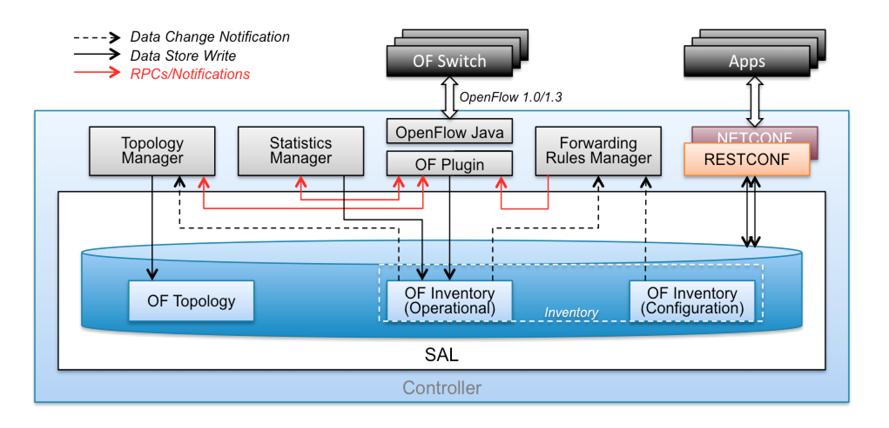

.. _ofp-architecture:

OpenFlow Plugin Architeture
===========================

Overview
--------

OpenFlow is a vendor-neutral standard communications interface defined
to enable interaction between the control and forwarding layers of an
SDN architecture. The OpenFlow plugin project intends to develop a
plugin to support implementations of the OpenFlow specification as it
develops and evolves. Specifically the project has developed a plugin
aiming to support OpenFlow 1.0 and 1.3.x. It can be extended to add
support for subsequent OpenFlow specifications. The plugin is based on
the Model Driven Service Abstraction Layer (MD-SAL) architecture.

Goals
-----

-  Southbound plugin and integration of OpenFlow 1.0/1.3.x library.

-  Ongoing support and integration of the OpenFlow specification.

-  The plugin should be implemented in an easily extensible manner.

-  Protocol verification activities will be performed on supported
   OpenFlow specifications.

High Level Architecture
-----------------------

- **OpenFlowJava**: is a library that implements the OpenFlow codec –
  it translates OpenFlow messages into their respective internal
  representations and vice versa.

- **OpenFlow Plugin**: terminates sessions to OpenFlow switches,
  provides a per-switch low-level OpenFlow service API (add-modify-flow,
  delete-flow, etc.)

- **Statistics Manager**: is responsible for collecting statistics and
  status from attached OpenFlow switches and storing them into the
  operational data store for applications’ use. 

- **Topology Manager**: is responsible for discovering the OpenFlow
  topology using LLDP and putting them into the operational data store
  for applications’ use.

- **Forwarding Rules Manager**: the “top level” OpenFlow module that
  exposes the OF functionality to controller apps, provides the app-level
  API. Main entity that manages the OpenFlow switch inventory and the
  configuration (programming) of flows in switches. It also reconciles
  user configuration with network state discovered by the OpenFlow plugin.

Security
--------

It is strongly recommended that any production deployments utilising
the OpenFlow Plugin do so with **TLS** encryption to protect against
various man-in-the-middle attacks. For more details please refer
to the :ref:`TLS section of the Operations guide <ofp-tls-guide>`.

Protocol Coverage
-----------------

Coverage has been moved to a `GoogleDoc Spreadsheet
<https://docs.google.com/spreadsheet/ccc?key=0AtpUuSEP8OyMdHNTZjBoM0VjOE9BcGhHMzk3N19uamc&usp=sharing%23gid=2#gid=0>`_

OF 1.3 Considerations
~~~~~~~~~~~~~~~~~~~~~

The baseline model is a OF 1.3 model, and the coverage tables primarily
deal with OF 1.3. However for OF 1.0, we have a column to indicate
either N/A if it doesn’t apply, or whether its been confirmed working.

OF 1.0 Considerations
~~~~~~~~~~~~~~~~~~~~~

OF 1.0 is being considered as a switch with: \* 1 Table \* 0 Groups \* 0
Meters \* 1 Instruction (Apply Actions) \* and a limited vocabulary of
matches and actions.

